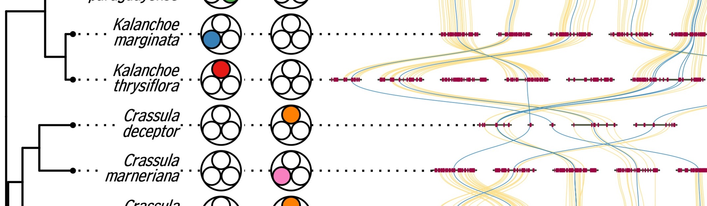

# phylochemistry: integated analyses of chemical and sequence data in the context of phylogeny



`phylochemistry` is a set of functions for chemical and genomic/transcriptomic analysis. These tools are provided though a combination of new functions and wrapped features of previously developed packages. A number of new functions to streamline analyses in this interdisciplinary space are also provided. This repository contains the latest version of the `phylochemistry` R package.

## INSTALL

`phylochemistry` is currently only available from this page. Install it using devtools:

```{r}
devtools::install_github("LucasBusta/phylochemistry", quiet = FALSE, force = TRUE)
packages <- c("phylochemistry")
lapply(packages, require, character.only = TRUE)
```

## VIGNETTE

The `phylochemistry` package is documented in [this vignette](http://thebustalab.github.io/phylochemistry/docs/index.html).

## NEW FEATURES

1. A Shiny app for GC-FID and GC-MS data analysis.
2. Open reading frame extraction from multiple fasta files.
3. Store BLAST results in a .csv file.
4. Minor ticks for ggplot2 axes.
5. Phylogenetic signal for discrete traits.
6. Analyze multiple sequence alignments for sites associated with user-defined function

## WRAPPED FEATURES

1. BLAST transcriptomes, via [NCBI BLAST+](https://blast.ncbi.nlm.nih.gov/Blast.cgi?PAGE_TYPE=BlastDocs&DOC_TYPE=Download).
2. Multiple sequence alignments and codon alignments of amino acid and nucleotide sequences, via [msa](https://bioconductor.org/packages/release/bioc/html/msa.html) and [orthologr](https://github.com/HajkD/orthologr).
3. Phylogenetic tree construction (including g-blocks trimming, pruning, ancestral states reconstruction), via [phangorn](https://cran.r-project.org/web/packages/phangorn/index.html).
4. Systematic read/write functions (csv, newick, wide tables, fasta, summary statistic tables, GFFs, chromatograms, mass spectra).
5. Phylogenetic signal for continuous traits.
